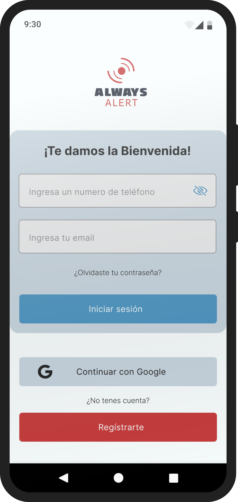
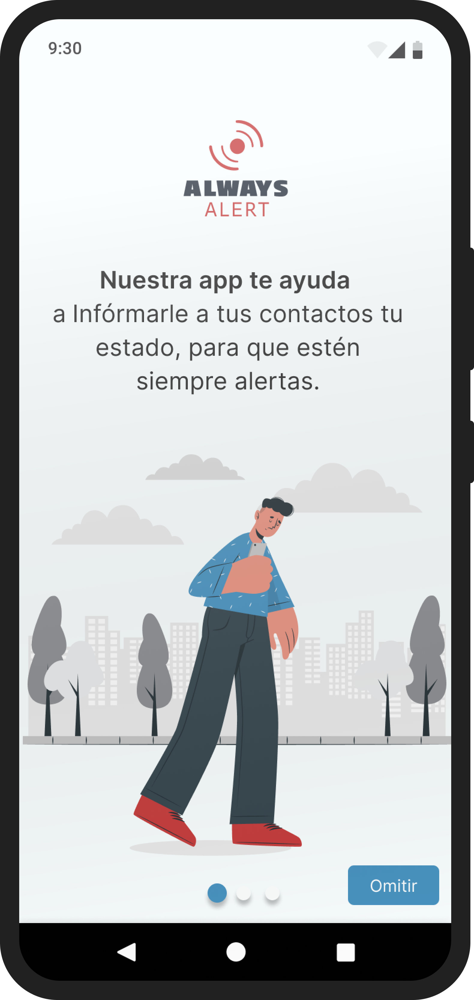
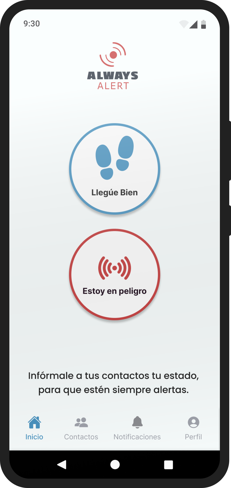
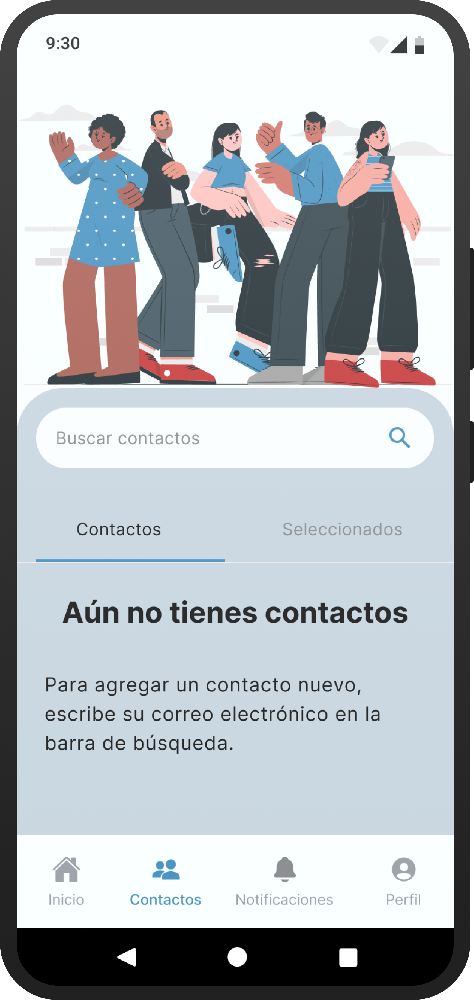
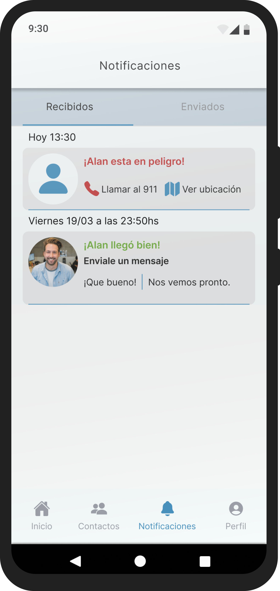
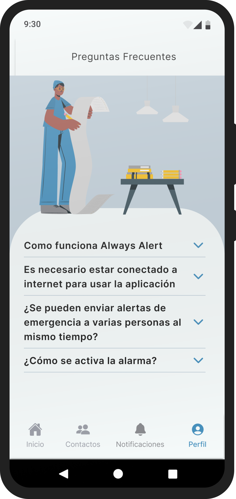
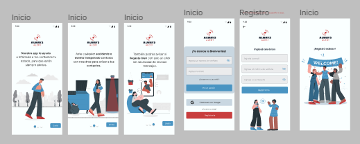
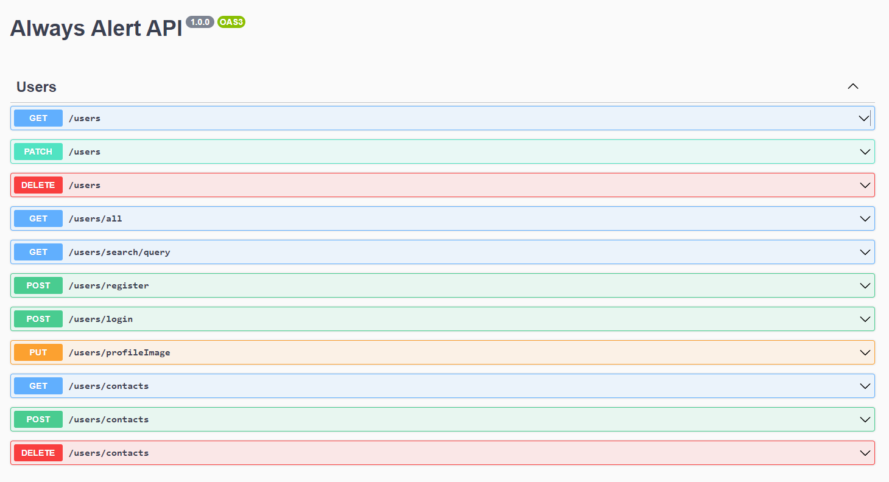

<div align="center">
  
</div>

# ALWAYS ALERT

Always Alert es una aplicación móvil imprescindible para aquellos que valoran su seguridad personal en cualquier situación. Esta app ha sido diseñada para proporcionar una forma rápida y precisa de enviar alertas a tus contactos de confianza en caso de emergencia. Ya sea que estés caminando solo en la noche o enfrentando una situación de peligro, Always Alert te brinda la tranquilidad de saber que alguien estará al tanto de tu ubicación y situación.


## Vistas
<div align="center">
  
  
  
  
  
  
</div>

## Diseño UX/UI
- <a href="https://www.figma.com/file/AqOzg6SvUO17JfZt8LP1b0/Always-Alert?node-id=468-15082&t=eVKjvYwiNdtzHyhM-0" target="_blank" rel="figma">
  Link a Figma
</a>



### Herramientas
- Figma
- Illustrator
- Canva 

## Frontend
- <a href="https://alwaysalertlanding.netlify.app/" target="_blank" rel="landing">
  Link a la Landing Page
</a>


### Tecnologías
- React Native
- Expo
- TailwindCSS 

## Backend
- <a href="https://alwaysalert.onrender.com/#/" target="_blank" rel="landing">
  Link API
</a>



### Tecnologías
- Node.js
- Express
- MongoDB

## 👷 Miembros del equipo

## UX/UI
<table>
  <tr>
    <td>
      <div align="center">
        
        <h4 style="margin-top: 1rem;">Crismar Silva</h4>
      </div>
      <div align="center">
        <a href="https://www.linkedin.com/in/crismar-silva" target="_blank" rel="author">
          
        </a>
      </div>
    </td>
     <td>
      <div align="center">
        
        <h4 style="margin-top: 1rem;">Malena Hernández</h4>
      </div>
      <div align="center">
        <a href="https://www.linkedin.com/in/malena-hern%C3%A1ndez-b36057188/" target="_blank" rel="author">
          
        </a>
      </div>
    </td>
  </tr>
</table>

## Frontend
<table>
  <tr>
    <td>
      <div align="center">
        
        <h4 style="margin-top: 1rem;">Martin Maruca</h4>
      </div>
      <div align="center">
        <a href="https://www.linkedin.com/in/martin-maruca/" target="_blank" rel="author">
          
        </a>
        <a href="https://github.com/martinmaruca" target="_blank" rel="author">
          
        </a>
      </div>
    </td>
    <td>
      <div align="center">
        
        <h4 style="margin-top: 1rem;">Lautaro Santillan</h4>
      </div>
      <div align="center">
        <a href="https://www.linkedin.com/in/lauti-santillan" target="_blank" rel="author">
          
        </a>
        <a href="https://github.com/LautiSantillan" target="_blank" rel="author">
          
        </a>
      </div>
    </td>
  </tr>
</table>

## Backend
<table>
  <tr>
    <td>
      <div align="center">
        
        <h4 style="margin-top: 1rem;">M. Agustin Lopez Ramallo</h4>
      </div>
      <div align="center">
        <a href="https://www.linkedin.com/in/marceloagustinlopezramallo/" target="_blank" rel="author">
          
        </a>
        <a href="https://github.com/agustinlopez23" target="_blank" rel="author">
          
        </a>
      </div>
    </td>
    <td>
      <div align="center">
        
        <h4 style="margin-top: 1rem;">Mauro Tomas Herrera</h4>
      </div>
      <div align="center">
        <a href="https://www.linkedin.com/in/mauro-tomas-herrera" target="_blank" rel="author">
          
        </a>
        <a href="https://github.com/tomasherrera1910" target="_blank" rel="author">
          
        </a>
      </div>
    </td>
    <td>
      <div align="center">
        
        <h4 style="margin-top: 1rem;">Raul Ereno</h4>
      </div>
      <div align="center">
        <a href="https://www.linkedin.com/in/raulereno" target="_blank" rel="author">
          
        </a>
        <a href="https://github.com/raulereno" target="_blank" rel="author">
          
        </a>
      </div>
    </td>
  </tr>
</table>

## 🚀 ¿Como usar?


Primero clona el repositorio desde GitHub:

```shell
git clone https://github.com/No-Country/s7-28-m-reactnative
```

Muévete a la carpeta del proyecto:

```shell
cd s7-28-m-reactnative
```

Instala las dependencias con el siguiente comando:

```shell
npm install
```

Inicia la aplicación de **desarrollo** usando el siguiente comando:

```shell
npm run dev
```