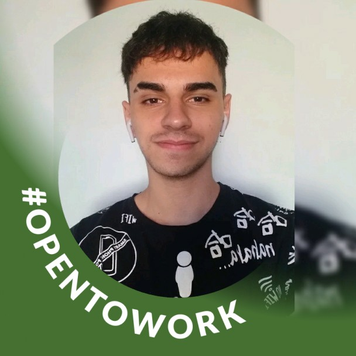
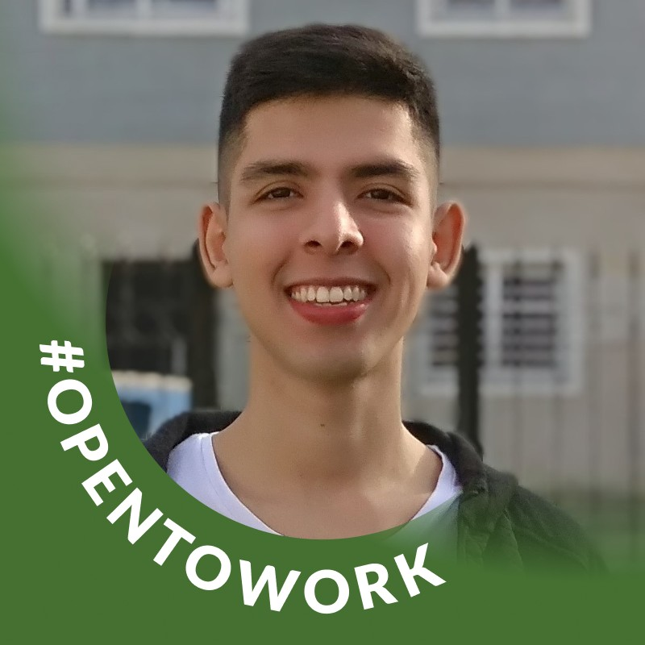

<div align="center">
  <h1>🤖 Proyecto | No Country 💻</h1>
  
</div>

## 📕 Descripción del proyecto

Proyecto Mobile Boton Antipanico

API URL:https://alwaysalert.onrender.com/

## 👷 Miembros del equipo

<table>
  <tr>
    <td>
      <div align="center">
        <a href="https://www.linkedin.com/in/marceloagustinlopezramallo/" target="_blank" rel="author">
          
        </a>
        <h4 style="margin-top: 1rem;">M. Agustin Lopez Ramallo</h4>
      </div>
    </td>
    <td>
      <div align="center">
        <a href="https://www.linkedin.com/in/mauro-tomas-herrera" target="_blank" rel="author">
          
        </a>
        <h4 style="margin-top: 1rem;">Mauro Tomas Herrera</h4>
      </div>
    </td>
    <td>
      <div align="center">
        <a href="https://www.linkedin.com/in/martin-maruca/" target="_blank" rel="author">
          
        </a>
        <h4 style="margin-top: 1rem;">Martin Maruca</h4>
      </div>
    </td>
  </tr>
  <tr>
    <td>
      <div align="center">
        <a href="https://www.linkedin.com/in/crismar-silva" target="_blank" rel="author">
          
        </a>
        <h4 style="margin-top: 1rem;">Crismar Silva</h4>
      </div>
    </td>
    <td>
      <div align="center">
        <a href="https://www.linkedin.com/in/lauti-santillan" target="_blank" rel="author">
          
        </a>
        <h4 style="margin-top: 1rem;">Lautaro Santillan</h4>
      </div>
    </td>
    <td>
      <div align="center">
        <a href="https://www.linkedin.com/in/raulereno" target="_blank" rel="author">
          
        </a>
        <h4 style="margin-top: 1rem;">Raul Ereno</h4>
      </div>
    </td>
  </tr>
  <tr>
     <td>
      <div align="center">
        <a href="https://www.linkedin.com/in/malena-hern%C3%A1ndez-b36057188/" target="_blank" rel="author">
          
        </a>
        <h4 style="margin-top: 1rem;">Malena Hernández</h4>
      </div>
    </td>
  </tr>
</table>

## 🚀 ¿Como usar?


Primero clona el repositorio desde GitHub:

```shell
git clone https://github.com/No-Country/s7-28-m-reactnative
```

Muévete a la carpeta del proyecto:

```shell
cd s7-28-m-reactnative
```

Instala las dependencias con el siguiente comando:

```shell
npm install
```

Inicia la aplicación de **desarrollo** usando el siguiente comando:

```shell
npm run dev
```

## ⚙️ Esta aplicación fue construida usando las siguientes tecnologías

- [React-Native](https://reactnative.dev/)
- [Express](https://expressjs.com/)
- [Vite](https://vitejs.dev/)
- [NPM Workspaces](https://docs.npmjs.com/cli/v7/using-npm/workspaces)
- [Standard](https://www.npmjs.com/package/ts-standard)
- [ESLint](https://www.npmjs.com/package/eslint)
- [Prettier](https://www.npmjs.com/package/prettier)

## 📄 Licencia

[MIT](https://opensource.org/licenses/MIT)

